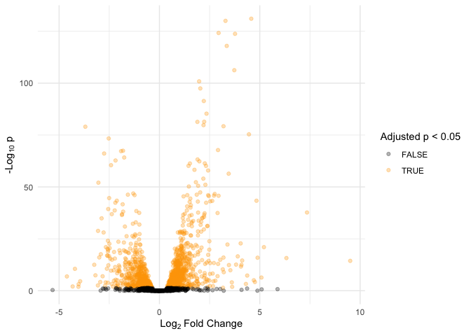

# Interactive Report: Airway Data

2026-03-05

# Study Summary

The following is a summary of the RNA-Seq analysis of airway smooth
muscle cells as reported by Himes et al. (2014).
(**himes_rna_seq_2014?**)

# Background & Objective

Asthma is a chronic inflammatory disease of the airways, often managed
using glucocorticoids (inhaled steroids). While these drugs are
effective at reducing inflammation, the specific molecular mechanisms by
which they act on Airway Smooth Muscle (ASM) cells—the cells responsible
for airway constriction—were not fully mapped prior to this study.

The researchers aimed to use RNA-seq to:

Characterize the global transcriptional response of ASM cells to
glucocorticoids.

Identify novel genes that might mediate the anti-inflammatory effects of
these drugs.

# Experimental Design

The study utilized four primary human ASM cell lines. These lines were
treated with:

Dexamethasone: A potent synthetic glucocorticoid (1 micromolar for 18
hours).

Vehicle Control: To establish a baseline of gene expression.

The researchers performed high-throughput RNA sequencing (RNA-seq),
generating approximately 30 million reads per sample. This allowed for a
high-resolution view of the transcriptome compared to older microarray
technologies.

# Key Results

The analysis revealed a robust and consistent transcriptional shift
across all four cell lines:

Differential Expression: See the volcano below for a visualization of
differentially expressed genes.

Identification of CRISPLD2: The most notable finding was the high
induction of the gene CRISPLD2 (Cysteine-Rich Secretory Protein LCCL
Domain Containing 2). This gene was previously known to be involved in
lung development but hadn’t been strongly linked to the glucocorticoid
response in asthma.

Functional Enrichment: Down-regulated genes were heavily involved in
inflammatory pathways, including those related to cytokine activity and
Chemokine signaling (e.g. CCL2, CXCL12).

Validation: The researchers used siRNA “knockdown” experiments to show
that when CRISPLD2 is inhibited, ASM cells produce more pro-inflammatory
cytokines, suggesting that CRISPLD2 is a key “brake” on inflammation.

### References
